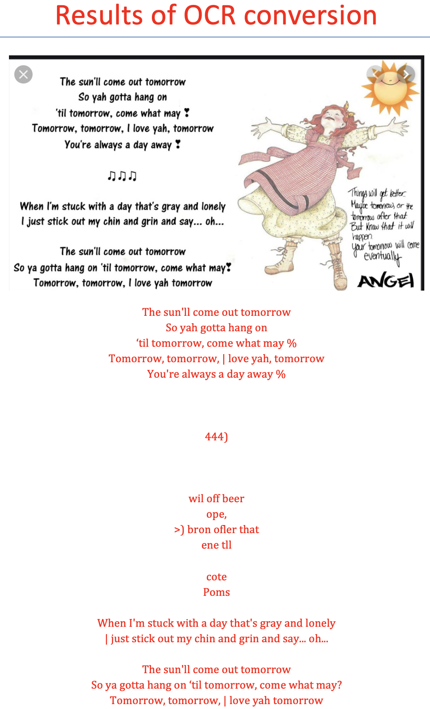
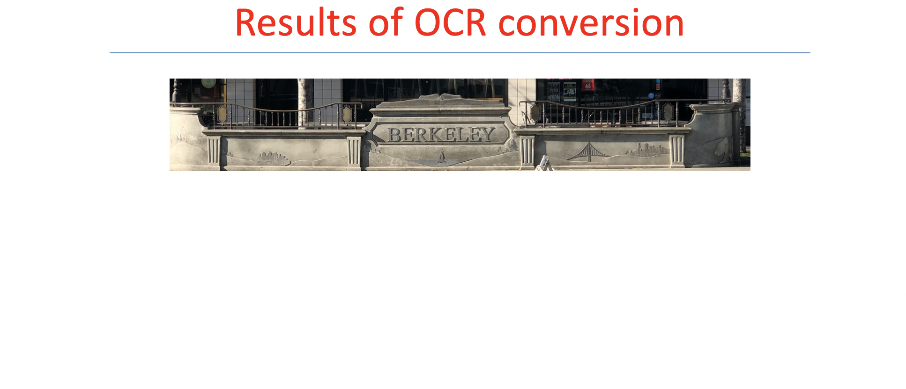

# PySee (In progress)
 A Python program that takes images containing text of one of six popular languages as input and uses optical-character recognition (OCR) to return a file that contains the texts from those images along with the original photos.

 # Setup

 ### Requirements

 *   pytesseract 0.3.1. (or newer). Terminal input: ```pip install pytesseract```.
 *   python-docx. Terminal input: ```pip install python-docx```.
 *   tessdata file containing all languages. Terminal input: ```sudo port install tesseract-<all>```.
 *   A Python interpreter.

 ### Startup

 1. Download PyRead.py.
 2. On your terminal CD into the directory containing the file. On macOS, this would likely be _/Users/[your_user_name]/Downloads/_ ; accordingly input ```cd downloads```.
 3. Input ```python PyRead.py```. A user interface should appear welcoming you with language options. Select the appropriate language of the images.
 4. A window should then appear asking which photos you want to select. You can select more than one photo in the same folder.

 ### The design process and observations

 Writing this program did not take many lines of code. However, there was an abundance of drudgery I endured for functionality.

 At first, I originally wrote the code for the user inputting each file by name, including the entire path (e.g., _/Users/[your_user_name]/spring2020/lecture_notes/images_). When testing my methods inside the class, I found this burdensome, as I had to type those file paths every time I tested a new image. I then decided to include a GUI to allow the user to select multiple images using his familiar OS interface with ```tkinter.filedialog.askopenfilenames()```. This easily streamlined my testing workflow, and I was able to test five images per language under one minute rather than one image every three minutes. This will be of great help for anyone wanting to experiment with the program themselves.

 I renamed the parameters ```images``` inside the class methods so they do not get confused for the ```img``` variables in __main__. I also renamed the variables inside each language method, so they represent their respective languages. This helps with debugging and helps avoid conflating variables.

 During unit testing I had issues comparing string return values of the methods with with the actual expected results. I then found that I did not have return statements; only print statements. I added return statements for the converted texts for unit testing and the possibility of these functions being used in abstraction as higher-order functions.

To add utility to the program, I added a .docx writer which takes the resultant array of strings from the OCR scanners and outputs them along their respective images a Microsoft Word document. I chose .docx format, because of its universal usage along with the flexibility it offers for editing the appearance of the document according to one's needs.

I also added the ability to choose the file location along with giving the Word Doc a custom name. This was surprisingly a challenging task to implement because of tkinter's ```asksaveasfilename``` returns the directory path along with the file name and the doc. I continuously faced errors trying pass the return value of ```asksaveasfilename``` to ```result.save```. I then used python's os-module ```split``` to cleverly separate the path name and the user-inputted file name and bind them to ```chosen_path``` and ```chosen_name```, respectively.

In the future, I plan on implementing a GUI for usability.

  ### Limitations
  Without a doubt, OCR is a software-engineering marvel. Gone are the days of hiring someone to tediously read and retype hundred-year-old scripts, the technology has allowed us to efficiently convert images to texts, giving access to numerous classical writings that can be opened as documents to parse while allowing human resources to be allocated to other causes.

  In my testing, however, I found that the training data provided to the tesseract algorithm was sufficient for mostly ideally-lit situations and characters with little digression from the training data. When testing the handwritten "¡Todo lo que hago es ganar" in Spanish, I found that even after varying the lighting, changing the crop of the photo with no other texts, and even constraining it to a screenshot of the handwritten text could not yield the "¡," which is crucial for interpreting and differentiating between other commonly-used characters among various languages.

  One notable case was when I called   ```img_to_english``` on a street photo I took, cropped down to the point where "Berkeley" was the only phrase in the frame. OCR failed to pick up any characters. I presume this is due to the lack of contrast that black texts on white backgrounds usually provide.

  

 ## References
1. https://pypi.org/project/pytesseract/
2. https://github.com/tesseract-ocr/tesseract/wiki
3. http://www.explainthatstuff.com/how-ocr-works.html


 ---

 ## License

 MIT License

 Copyright (c) 2020 Ranelle Gomez

 ---

 ## Author Info

 As of writing in January 2020, I am an undergraduate at UC Berkeley studying applied math and computer science. If you have any questions or comments, please reach me by the following: 1) email: ranellegomez@gmail.com 2) Text: (323) 999-4720 3)
 LinkedIn: https://www.linkedin.com/in/ranellegomez/
